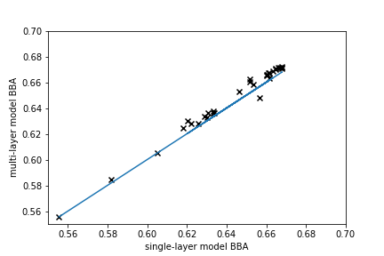

# BioSNICAR_GO_PY Parameterisation

This repository is specifically for the parameterization of BioSNICAR_GO, ideally creating a single linear equation that predicts the full model output to sufficient accuracy and can then be used as a lightweight alternative to the full RTM for surface mass balance modelling.

For users interested in the full model, the repository is here: www.github.com/jmcook1186/BioSNICAR_GO_PY.

To run code in this repository, the Data directory from the full model repo must be copied into the top level directory here as this contains all the optical property files. Not included here as there are >5000 files.

## Parameterisation Background

The aim of this repository is to define a set of simple linear equations that can predict the output of the BiOSNICAR_GO radiative transfer model to a sufficient degree of accuracy (say r2 > 0.9) so that those equations can replace the full model as the albedo component in large, computationally expensive surface mass balance simulations. Specifically, this repository is designed to parameterise the full RTM for the SMB model MAR. This is part of an ongoing effort led by @atedstone to completely replace MAR's albedo scheme and couple it to an ice surface physical development model. The variables we need to predict are the broadband albedo (BBA) of the ice an the total energy absorbed in the surface layer (abs). The independent variables are solar zenith angle, ice layer thickness, ice density and concentration of glacier algae on the ice surface.

The parameterisation works by running the full RTM with a large set of input values for each of the predictor variables and recording the predicted BBA and abs. Multiple linear regression on the resulting dataset, first with BBA as the dependent variable and then with abs as the dependent variable, yields two linear equations that predict BBA and abs from the four input variables.

The regression is performed on a dataset generated from a predefined set of input values. The model performance is then evaluated by running the full model with an independent set of input values with no duplication of values in the original model runs. For the same inout values, the BBA and abs is also predicted using the linear equations. The linear model performance is then assessed by regressing the full model predictions against the linear equation predictions and also calculating the standard error of each set of predictions.

## Validity bounds and model config

The parameterisation is valid across the following ranges of input variables:

layer thickness dz: 0.15 - 1 m
algae concentration: 0 - 40,000 ppb (x 10 by default to account for concentration in upper 1mm)
ice density: 400-850 kgm-3
solar zenith angles: 30 - 70 degrees

The ice column is structured with an upper 1mm layer that contains all glacier algae overlying a second layer of thickness dz. This second layer spans from the underside of the upper 1mm algal layer to the upper boundary of a semi-infinite underlying ice layer whose spectral albedo is set equal to that of field measured smooth, clean glacier ice. The spectral distribution of the incoming irradiance is fixed at snicar's default "summit summer" profile. The ice is always assumed to be solid slabs rather than granular layers whose albedo is calculated using snicar's adding-doubling solver (Whicker et al 2021).

## Density Transformer

There is also a script called `density_transformer.py` in this repository. The purpose of this is to bridge the parameterised RTM to the WC development model we are bolting into MAR. The reason this is necessary is that the WC development model is depth-resolved with fixed layer thicknesses spanning a constant total WC depth. However, the SNICAR model parameterisation is a single layer configuration that takes WC depth as a variable. The solution to this is the density transformer which takes the density and layer thickness profile from the new MAR WC model and takes a weighted average. The weights were optimised so that the BBA predicted by the transformed single layer representation of the column best matched the multilayer representation from the WC model. 

Specifically, the vertical layers are first trimmed so that any layers with density > 915 kg m-3 are assumed to be solid ice and therefore treated as part of the underlying ice and omitted from the weathering crust. The sum of the remaining layer thicknesses gives the layer thickness to feed the snicar parameterisation. The density is then a weighted average of the densities of the layers. There are two stages to the weighting: 1) weighted by layer thickness, 2) weighted by distance below the upper surface. This two-stage weighting represents the fact that the albedo is influenced more by ice closer to the surface and less by ice at depth, while also accounting for the actual mass of ice of each density present in the column. 

The transformed density very accurately matches the BBA of the original multilayer density in our unit tests:

linear regression between the multi-layer and single layer BBA estimates had a coefficient of determination of 0.9927 (p = 4.123 e-19) an standard error of 0.0227

Reproduce the unit tests using the density_transformer_tests.py script.

## Caveats and nuances

The point of this parameterisation is to create the most minimal possible implementation of BioSNICAR that can be implemented into MAR. Simplified deterministic models, deep learning and decision tree versions were all considered and experimented with, but there is a very high importance placed on memory management as well as processing time in MAR, and there is also significant development time required to translate any module developed here into FORTRAN for integration into the MAR source. Therefore, aiming for a set of linear equations was reasoned to be the optimal solution as it is trivial to program in MAR, exceptionally fast to calculate and has negligible memory implications.

The effective radii of bubbles in the ice is ommitted as a predictor in this version of the repository. This is a design choice and the rationale is as follows:

a) we lack empirical data showing how effective bubble radius develops as the surface weathering crust grows and decays
b) we lack conceptual knowledge to build bubble radii into current weathering crust development models
c) qualitative observations indicate a very large range of bubble and cavity sizes in weathered ice and one density may equate to many different effective radii configurations that would be difficult to parameterize

For these reasons, we instead propse a heuristic where the effective radius of bubbles/cavities is set equal to 1000- density (i.e. for a density of 600 kg m-3, the effective radius is 400 microns). The rationale for this is that it captures a realistically large range of effective radii while also asserting that cavity size increases as density decreases which is consistent with observations of density-porosity relationships in a developing weathering crust (cavities expand as the weathering crust grows).

## Results

The parameterisation models are:

### BBA

BBA = (-3.654e-6 * Malg) + (0.0009 * zenith) + (0.0648 * dz) - (0.0001 * density) + 0.6466 

### Absorption

abs = (0.002 * Malg) - (-2.2 * zenith) + (2.8651 * dz) + (0.0589 * density) + 153.9808

Their performance aganst the full model was as follows:

### BBA
(black line represents 1:1 fit)

linear regression model between full model and parameterisation using "training" dataset: r2 = 0.945 (p < 0.001)

linear regression between full model and parameterisation using unseen data: r2 = 0.999 (p < 0.01)

absolute error = 0.009 +/- 0.006 (albedo units)

### Abs
(black line represents 1:1 fit)

linear regression model between full model and parameterisation using "training" dataset: r2 = 0.947 (p < 0.001)

linear regression between full model and parameterisation using unseen data: r2 = 0.998 (p < 0.01)

absolute error = 6.00 +/- 4.09 W/m^2

## MAR Workflow

values required for the albedo parameterisation are:

Malg (algal concentration on surface in cells/mL)
dz (WC thickness in m)
density (representative density for ice column in kg m-3)
zenith (solar zenith angle in degrees)

The WC component of MAR will generate an array of densities. These should become inputs to density_transformer.py, returning both dz and density. Zenith is available during the MAR runtime. Malg is generated by the algal growth model for a given pixel/timestep. Therefore, all the values are available in each timestep and each pixel to estimate the albedo using the SNICAR parameterisation.
