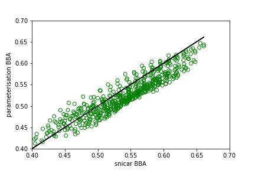
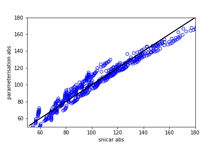

# BioSNICAR_GO_PY Parameterisation

This repository is specifically for the parameterization of BioSNICAR_GO, ideally creating a single linear equation that predicts the full model output to sufficient accuracy and can then be used as a lightweight alternative to the full RTM for surface mass balance modelling.

For users interested in the full model, the repository is here: www.github.com/jmcook1186/BioSNICAR_GO_PY.

To run code in this repository, the Data directory from the full model repo must be copied into the top level directory here as this contains all the optical property files. Not included here as there are >5000 files.

## Parameterisation Background

The aim of this repository is to define a set of simple linear equations that can predict the output of the BiOSNICAR_GO radiative transfer model to a sufficient degree of accuracy (say r2 > 0.9) so that those equations can replace the full model as the albedo component in large, computationally expensive surface mass balance simulations. Specifically, this repository is designed to parameterise the full RTM for the SMB model MAR. This is part of an ongoing effort in collaboraton with @atedstone to completely replace MAR's albedo scheme and couple it to an ice surface physical development model. The variables we need to predict are the broadband albedo (BBA) of the ice an the total energy absorbed in the surface layer (abs). The independent variables are solar zenith angle, ice layer thickness, ice density and concentration of glacier algae on the ice surface.

The parameterisation works by running the full RTM with a large set of input values for each of the predictor variables and recording the predicted BBA and abs. Multiple linear regression on the resulting dataset, first with BBA as the dependent variable and then with abs as the dependent variable, yields two linear equations that predict BBA and abs from the four input variables.

The regression is performed on a dataset generated from a predefined set of input values. The model performance is then evaluated by running the full model with an independent set of input values with no duplication of values in the original model runs. For the same inout values, the BBA and abs is also predicted using the linear equations. The linear model performance is then assessed by regressing the full model predictions against the linear equation predictions and also calculating the standard error of each set of predictions.

## Caveats and nuances

The point of this parameterisation is to create the most minimal possible implementation of BioSNICAR that can be implemented into MAR. Simplified deterministic models, deep learning and decision tree versions were all considered and experimented with, but there is a very high importance placed on memory management as well as processing time in MAR, and there is also significant development time required to translate any module developed here into FORTRAN for integration into the MAR source. Therefore, aiming for a set of linear equations was reasoned to be the optimal solution as it is trivial to program in MAR, exceptionally fast to calculate and has negligible memory implications.

The effective radii of bubbles in the ice is ommitted as a predictor in this version of the repository. This is a design choice and the rationale is as follows:

a) we lack empirical data showing how effective bubble radius develops as the surface weathering crust grows and decays
b) we lack conceptual knowledge to build bubble radii into current weathering crust development models
c) qualitative observations indicate a very large range of bubble and cavity sizes in weathered ice and one density may equate to many different effective radii configurations that would be difficult to parameterize

For these reasons, we instead propse a heuristic where the effective radius of bubbles/cavities is set equal to 1000- density (i.e. for a density of 600 kg m-3, the effective radius is 400 microns). The rationale for this is that it captures a realistically large range of effective radii while also asserting that cavity size increases as density decreases which is consistent with observations of density-porosity relationships in a developing weathering crust (cavities expand as the weathering crust grows).

## Results

The parameterisation models are:

### BBA

BBA = (-2.416e-6 * Malg) + (0.0015 * zenith) + (0.9176 * dz) - (3.417e-5 * density) + 0.4288 

### Absorption

abs = (0.0016 * Malg) - (2.1188 * zenith) + (4.3912 * dz) + (0.0857 * density) + 134.4134

Their performance aganst the full model was as follows:

### BBA
(black line represents 1:1 fit)

linear regression between full model and parameterisation r2 = 0.998 (p < 0.01)
absolute error = 0.022 +/- 0.012 (albedo units)

### Abs
(black line represents 1:1 fit)

linear regression between full model and parameterisation r2 = 0.996 (p < 0.01)
absolute error = 5.41 +/- 3.79 W/m^2 (error ~0.6% of total energy)
